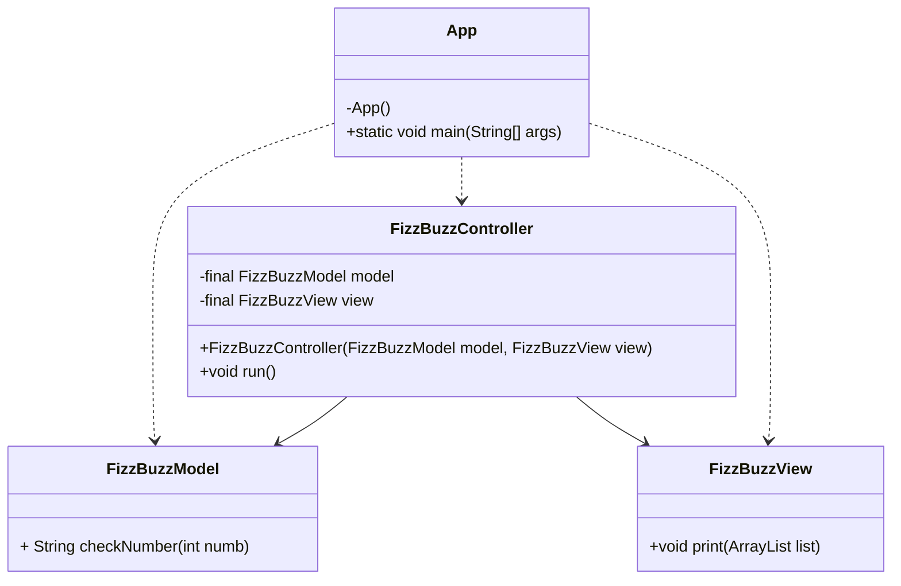
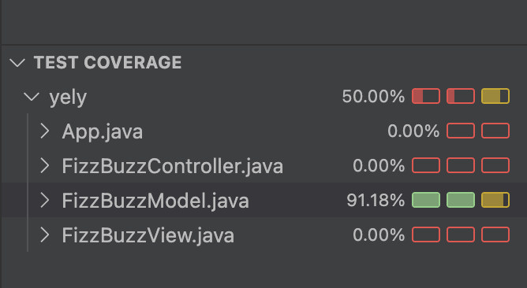

# Kata FizzBuzz Java

---

## Requirements

- JDK 21
- Maven
- JUnit 5

---

## Dependencies

- Hamcrest
- JUnit 5

---

## Exercise Description

Write a program that prints the numbers from 1 to 100 following these rules:

### Stage 1

- Return `Fizz` if the number is divisible by 3.
- Return `Buzz` if the number is divisible by 5.
- Return `FizzBuzz` if the number is divisible by both 3 and 5.
- Return the number itself if none of the above conditions apply.

### Stage 2

- Return `Fizz` if the number is divisible by 3 or contains the digit 3 (e.g., 534).
- Return `Buzz` if the number is divisible by 5 or contains the digit 5 (e.g., 25).

---

## 📊 Class Diagram

---

## 📸 Test Coverage

